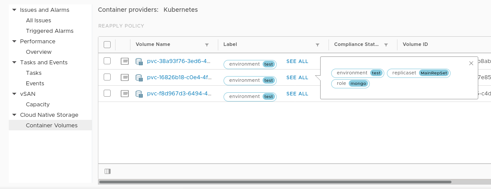

# Packer Kubeadm Vsphere

This is packer configuration to build a vm template to run kubeadm in a vsphere environment, mostly for testing the Cloud Provider Interface (CPI) and Container Storage Interface (CSI). You can use packer to build a template and then use that template to create kubernetetes nodes in vsphere.

This is mostly based on [Myles Gray's work](https://blah.cloud/kubernetes/creating-an-ubuntu-18-04-lts-cloud-image-for-cloning-on-vmware/).

I also borrowed most of the packer config from a github repository that I can no longer find.

## Versions and Dependencies

*NOTE: You have to use an older version of packer with `packer-builder-vsphere-iso.linux`.*

| Component     | Version       |
| ------------- |:-------------:|
| Docker        | 19.03         |
| Kubernetes    | 1.17.0        |
| Ubuntu        | 18.04         |
| Packer        | 1.3.5         |
| vsphere-iso   | latest        |
| Powershell    | 6.2.3         |
| Govc          | 0.21.0        |

### vsphere-iso

Install the latest [vsphere-iso](https://github.com/jetbrains-infra/packer-builder-vsphere/releases) release and ensure the binary is available on your path.

```
$ which packer-builder-vsphere-iso.linux
~/bin/packer-builder-vsphere-iso.linux
```

## Build Template in vSphere

Use the sample variables file.

*NOTE: The ubuntu user and password are hardcoded into the preseed file so don't change those unless you want to also change the preseed file.*

```
cp variables.json.example variables.json
```

Edit that file and add vcenter information and a public key.

Now build.

```
packer build --force -var-file variables.json ubuntu-18.json
```

Once that completes there should be a new template that can be used to build k8s nodes.

## Built an OS Customization Spec

Currently it seems we need to run some powershell to get a customized vm spec. We are using this instead of something like cloud-init.

*NOTE: This requires powershell installed.*

```
$ pwsh
> Connect-VIServer <vcenter> -User <administrator@vsphere.local> -Password <Admin!23>
> New-OSCustomizationSpec -Name Ubuntu -OSType Linux -DnsServer <dns server> -DnsSuffix <dns suffix> -Domain <dns suffix> -NamingScheme vm
```

## Deploy Nodes From Template

Now we can create vms from that template and spec.

*NOTE: This requires govc is installed and configured.*

```
govc vm.clone -vm <template name> -customization=Ubuntu k8s-controller
govc vm.clone -vm <template name> -customization=Ubuntu k8s-node-1
govc vm.clone -vm <template name> -customization=Ubuntu k8s-node-2
```

Find all all nodes.

```
$ govc find / -type m -name 'k8s*'
/Datacenter/vm/k8s-controller
/Datacenter/vm/k8s-node-1
/Datacenter/vm/k8s-node-2
```

Optionally move them into a folder.

```
govc folder.create /Datacenter/vm/k8s-vcp
govc object.mv /Datacenter/vm/k8s-\* /Datacenter/vm/k8s-vcp
```

Get the IPs for the nodes.

```
export K8S_CONTROLLER=`govc vm.ip k8s-controller`
export K8S_NODE_1=`govc vm.ip k8s-node-1`
export K8S_NODE_2=`govc vm.ip k8s-node-2`
echo $K8S_CONTROLLER
echo $K8S_NODE_1
echo $K8S_NODE_2
```

## Deploy K8S, CPI and CSI

At this point you should be at the *Installing the Kubernetes master node(s)* section in this [document](https://cloud-provider-vsphere.sigs.k8s.io/tutorials/kubernetes-on-vsphere-with-kubeadm.html). There's still a fair bit more to do... :)

Once you complete everything in the above tutorial, you should be able to deploy CNS volumes.

